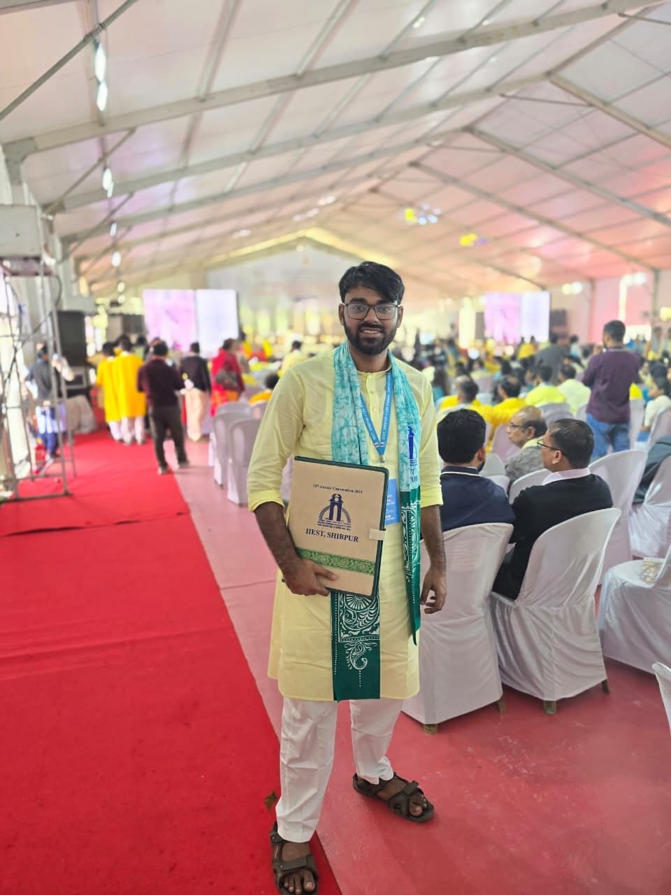
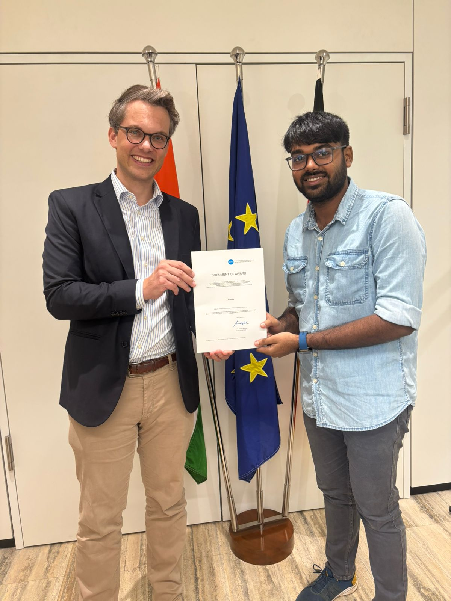

---
hide:
  - navigation
  - toc
---

{ .profile-pic }

# Arka Bisui

### M.Tech Candidate, Transportation Systems Engineering — IIT Bombay

*Turning traffic data into signal control that actually moves people.*

[Download CV :material-file-download:](assets/Arka-Bisui-CV.pdf){ .md-button .md-button--primary }
[Get in touch :material-email:](contact.md){ .md-button }

## About Me

{ .about-pic }

I am a postgraduate student in the Department of Civil Engineering at **IIT Bombay**, specialising in **Transportation Systems Engineering** (CPI 9.63). My work sits at the intersection of traffic flow theory, discrete choice modelling and micro-simulation — currently on adaptive signal control for vehicle-actuated corridors.

Before IIT Bombay I completed my B.Tech in Civil Engineering at **IIEST Shibpur**, where I worked across structural design, geotechnical modelling and public health engineering. That breadth is deliberate: transportation problems rarely stay inside one discipline.

I am driven by research and innovation, and by applying analytical and experimental methods to complex engineering problems in order to develop data-driven, impactful solutions.

## Skills

-   :material-traffic-light: **Traffic & Transport**

    ---

    PTV VISSIM · PTV VISUM · IITPAVE · Traffic signal design · Discrete choice modelling

-   :material-map: **Geospatial & Data**

    ---

    QGIS · R Programming Language · Spatial analysis · Statistical modelling

-   :material-office-building: **Structural & Design**

    ---

    STAAD.Pro · AutoCAD Civil 3D · RCC & steel design · Quantity estimation

-   :material-account-group: **Professional**

    ---

    MS Office · Technical writing · Team leadership · Event management

## Education at a Glance

| Degree | Institution | Result | Years |
|---|---|---|---|
| M.Tech, Civil Engineering (Transportation) | IIT Bombay | 9.63 CPI *(ongoing)* | 2025 – 2027 |
| B.Tech, Civil Engineering | IIEST Shibpur | 8.78 CGPA | 2021 – 2025 |
| Higher Secondary | Bankura Christian Collegiate School | 93.00 % | 2019 – 2021 |
| Secondary | Bankura Christian Collegiate School | 94.71 % | Until 2019 |

[See the full record :material-arrow-right:](experience.md){ .md-button }

## Connect

-   :material-email: **Email**

    ---

    [arkabisui6@gmail.com](mailto:arkabisui6@gmail.com)

-   :material-phone: **Phone**

    ---

    [+91 8918124750](tel:+918918124750)

-   :fontawesome-brands-linkedin: **LinkedIn**

    ---

    [/in/arkabisui](https://www.linkedin.com/in/arkabisui)

-   :fontawesome-brands-github: **GitHub**

    ---

    [@arkabisui](https://github.com/arkabisui)

